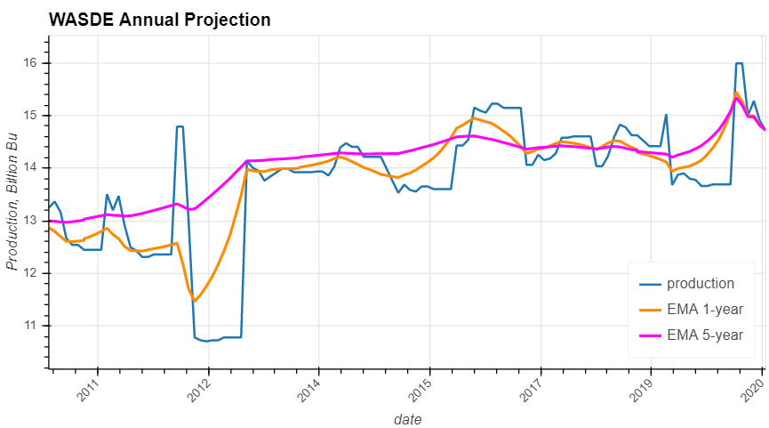

# **Data Farming**
A group project via the Rice University FinTech Bootcamp to demonstrate "FinTech Financial Programming and Quantitative Analysis."

---

## **Table of Contents**
* [General Information](#general-info)
* [Research Questions](#research-questions)
* [Screenshots](#screenshots)
* [Technologies](#technologies)
* [Sources](#sources)
* [Status](#status)
* [Contributors](#contributors)

---

## **General Information**

- Investing in exchange traded funds (ETFs) and futures has advantages while making sure to do the appropriate research and analysis is necessary before making decisions.  This group of contributors wondered if there are any underlying process, commodities, and other factors that might sway specific areas of the futures and ETF markets, so set out on a two week journey to research, analyze and summarize various questions.

    - 1. Is there a relationship between futures market and the respective ETFs on the response to the crops report (i.e.- is one more sensitive than the other)?

    - 2. Is there a correlation between reported crop production vs. expected crop production and futures/ETF pricing?

    - 3. Is Monte Carlo simulation a valid method for predicting the next reported volumes?

- A status and summary of the groups findings are below.

---

## **Research Questions**

### - Is there a relationship between futures market and the respective ETFs on the response to the crops report (i.e.- is one more sensitive than the other)?

- _Short description of what we found and any relevant plots go here_

### - Is there a correlation between reported crop production vs. expected crop production and futures/ETF pricing?

- _Short description of what we found and any relevant plots go here_

### - Is Monte Carlo simulation a valid method for predicting the next reported volumes?

- Monte Carlo simulation is a valid method for determining a range of reported volumes, while conducting further analysis on the collected data is needed to determine validity.

---

## Screenshots

* Estimating production data with possible trigger indicators

* 

* Precipitation vs Production

* 

* ETF vs Futures rolling correlation

* 

---

## **Technologies**

* Python - Version 3.8.5
* VS Code - Version 1.49.1
* Jupyter Notebook - Version 6.1.1
* Windows 10
* Library - calendar
* Library - bokeh
* Library - csv
* Library - datetime
* Library - hvplot.pandas
* Library - json
* Library - matplotlib.pyplot
* Library - numpy
* Library - os
* Library - pandas
* Library - panel
* Library - pathlib
* Library - plotly.express
* Library - pprint
* Library - psycopg2
* Library - python-dotenv
* Library - requests
* Library - seaborn
* Library - sqlalchemy

---

## **Sources**

- https://rice.bootcampcontent.com/Rice-Coding-Bootcamp/rice-hou-fin-pt-09-2020-u-c/blob/master/class/08-Project_1/fintech-projects-collaboration-with-git-v1.0.0.pdf

- http://www.rcc-acis.org/index.html

- https://quickstats.nass.usda.gov/api

- https://usda.library.cornell.edu/concern/publications/3t945q76s?locale=en

- https://www.pnas.org/content/114/35/9326

---

## **Status**

Project is: _In Progress_

---

## **Contributors**

- Carolina Benzaquen
- Jordan Gross
- Jonthan Owens
- Travis Stewart
